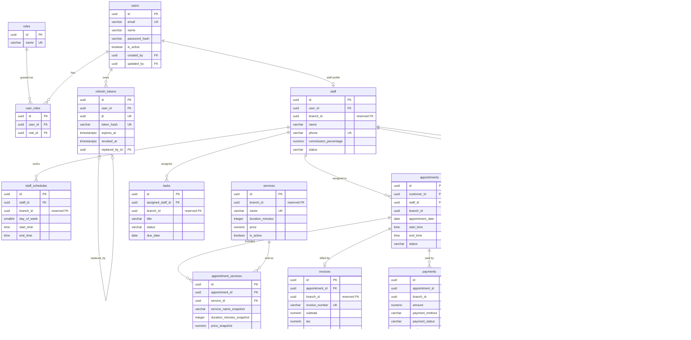

# Salon Management System — Entity Relationship Diagram

Version: 1.0  
Source of truth: `Database_Design.md`

This document shows table relationships, cardinality, primary keys, and foreign keys.  
It does not define application code, ORM models, or migrations.

---

## 1. Notation

| Symbol | Meaning |
|---|---|
| `PK` | Primary key (`id UUID` on every table) |
| `FK` | Foreign key |
| `UK` | Unique key (partial unique on active rows unless noted) |
| `1` | Exactly one |
| `0..1` | Zero or one |
| `1..N` / `N` | One or many |
| `0..N` | Zero or many |
| solid line | V1 enforced foreign key |
| reserved | Column exists in V1; FK is added later |

Crow’s-foot style used in Mermaid:

| Mermaid | Cardinality |
|---|---|
| `\|\|--\|\|` | one to one |
| `\|\|--o\|` | one to zero-or-one |
| `\|\|--o{` | one to zero-or-many |
| `}o--o{` | many to many (via junction) |

Audit columns `created_by` and `updated_by` logically reference `users.id` on every table. They are omitted from the diagrams so the business graph stays readable.

---

## 2. Cardinality catalog

### 2.1 V1 (enforced)

| Parent | Child | Parent -> child | Child -> parent | Foreign key | On delete |
|---|---|---|---|---|---|
| `users` | `user_roles` | 1 -> N | N -> 1 | `user_roles.user_id` | Restrict |
| `roles` | `user_roles` | 1 -> N | N -> 1 | `user_roles.role_id` | Restrict |
| `users` | `refresh_tokens` | 1 -> N | N -> 1 | `refresh_tokens.user_id` | Restrict |
| `refresh_tokens` | `refresh_tokens` | 0..1 -> 0..1 | 0..1 -> 0..1 | `refresh_tokens.replaced_by_id` | Set null |
| `users` | `staff` | 1 -> 0..1 | 1 -> 1 | `staff.user_id` | Restrict |
| `staff` | `staff_schedules` | 1 -> N | N -> 1 | `staff_schedules.staff_id` | Restrict |
| `staff` | `appointments` | 1 -> N | N -> 1 | `appointments.staff_id` | Restrict |
| `customers` | `appointments` | 1 -> N | N -> 1 | `appointments.customer_id` | Restrict |
| `appointments` | `appointment_services` | 1 -> N | N -> 1 | `appointment_services.appointment_id` | Restrict |
| `services` | `appointment_services` | 1 -> N | N -> 1 | `appointment_services.service_id` | Restrict |
| `appointments` | `invoices` | 1 -> 0..1 | 1 -> 1 | `invoices.appointment_id` | Restrict |
| `appointments` | `payments` | 1 -> N | N -> 1 | `payments.appointment_id` | Restrict |
| `appointments` | `commissions` | 1 -> 0..1 | 1 -> 1 | `commissions.appointment_id` | Restrict |
| `staff` | `commissions` | 1 -> N | N -> 1 | `commissions.staff_id` | Restrict |
| `appointments` | `tips` | 1 -> N | N -> 1 | `tips.appointment_id` | Restrict |
| `staff` | `tips` | 1 -> N | N -> 1 | `tips.staff_id` | Restrict |
| `staff` | `tasks` | 1 -> N | N -> 1 | `tasks.assigned_staff_id` | Restrict |

`roles` has no incoming business foreign keys.

### 2.2 Future (reserved)

| Parent | Child | Parent -> child | Foreign key |
|---|---|---|---|
| `branches` | `staff` | 1 -> N | `staff.branch_id` |
| `branches` | `customers` | 1 -> N | `customers.branch_id` |
| `branches` | `appointments` | 1 -> N | `appointments.branch_id` |
| `branches` | `payments` | 1 -> N | `payments.branch_id` |
| `branches` | `services` | 1 -> N | `services.branch_id` |
| `branches` | `staff_schedules` | 1 -> N | `staff_schedules.branch_id` |
| `branches` | `invoices` | 1 -> N | `invoices.branch_id` |
| `branches` | `commissions` | 1 -> N | `commissions.branch_id` |
| `branches` | `tips` | 1 -> N | `tips.branch_id` |
| `branches` | `tasks` | 1 -> N | `tasks.branch_id` |
| `branches` | `products` | 1 -> N | `products.branch_id` |
| `branches` | `product_stock` | 1 -> N | `product_stock.branch_id` |
| `branches` | `customer_memberships` | 1 -> N | `customer_memberships.branch_id` |
| `products` | `product_stock` | 1 -> N | `product_stock.product_id` |
| `products` | `appointment_consumed_products` | 1 -> N | `appointment_consumed_products.product_id` |
| `appointments` | `appointment_consumed_products` | 1 -> N | `appointment_consumed_products.appointment_id` |
| `customers` | `customer_memberships` | 1 -> N (0..1 active) | `customer_memberships.customer_id` |
| `membership_plans` | `customer_memberships` | 1 -> N | `customer_memberships.membership_plan_id` |

---

## 3. ASCII ERD

### 3.1 V1 overview

```text
roles 1 -------- N user_roles N -------- 1 users 1 -------- 0..N refresh_tokens
                                              |                         |
                                              |                         +-- replaced_by_id --> refresh_tokens (0..1)
                                              |
                                              0..1
                                            staff
                                              |
          +------------------+----------------+------------------+
          |                  |                |                  |
          N                  N                N                  N
   staff_schedules         tasks        appointments       commissions, tips
                                                |
                                                +-- N appointments <-- 1 customers
                                                |
                     +------------+-------------+------------+------------+
                     |            |             |            |            |
                     N           0..1           N           0..1          N
          appointment_services invoices     payments    commissions     tips
                     |
                     N
                     |
                  1 services
```

### 3.2 V1 detailed boxes (keys only)

```text
+----------------------+          +----------------------+
| roles                |          | users                |
|----------------------|          |----------------------|
| PK id         UUID   |          | PK id         UUID   |
| UK name       VARCHAR|          | UK email      VARCHAR|
+----------1-----------+          +----------1-----------+
           |                                 |
           N                                 N
           |                                 |
           +--------> +----------------------+
                      | user_roles           |
                      |----------------------|
                      | PK id         UUID   |
                      | FK user_id    UUID   |
                      | FK role_id    UUID   |
                      | UK (user_id, role_id)|
                      +----------------------+


+----------------------+ 1            0..N +---------------------------+
| users                |------------------>| refresh_tokens            |
|----------------------|                   |---------------------------|
| PK id         UUID   |                   | PK id              UUID   |
+----------1-----------+                   | FK user_id         UUID   |
           |                               | FK replaced_by_id  UUID   | --> self 0..1
           0..1                            | UK jti             UUID   |
           |                               | UK token_hash             |
           v                               +---------------------------+
+----------------------+
| staff                |
|----------------------|
| PK id         UUID   |
| FK user_id    UUID UK|
|    branch_id  UUID   |  reserved, no FK in V1
+----------1-----------+
           |
           N
           v
+----------------------+
| staff_schedules      |
|----------------------|
| PK id         UUID   |
| FK staff_id   UUID   |
|    branch_id  UUID   |  reserved
+----------------------+


+----------------------+ 1              N +----------------------+
| customers            |----------------->| appointments         |
|----------------------|                  |----------------------|
| PK id         UUID   |                  | PK id         UUID   |
| UK phone      VARCHAR|                  | FK customer_id UUID  |
|    branch_id  UUID   |  reserved        | FK staff_id    UUID  | --> staff.id (N -> 1)
+----------------------+                  |    branch_id   UUID  |  reserved
                                          +----------1-----------+
                                                     |
       +----------------+--------------+-------------+-------------+
       |                |              |             |             |
       N               0..1            N            0..1           N
       v                v              v             v             v
+------------------+ +----------+ +----------+ +------------+ +--------+
| appointment_     | | invoices | | payments | | commissions| | tips   |
| services         | |----------| |----------| |------------| |--------|
|------------------| | PK id    | | PK id    | | PK id      | | PK id  |
| PK id            | | FK appt_ | | FK appt_ | | FK appt_id | | FK appt|
| FK appointment_id| |    id UK | |    id    | |    UK      | |    _id |
| FK service_id    | | UK number| | branch_id| | FK staff_id| | FK sta |
+--------N---------+ +----------+ +----------+ +------------+ | ff_id  |
         |                                                    +--------+
         1
         v
+----------------------+
| services             |
|----------------------|
| PK id         UUID   |
| UK name       VARCHAR|
|    branch_id  UUID   |  reserved
+----------------------+


+----------------------+ 1              N +------------------------+
| staff                |----------------->| tasks                  |
|----------------------|                  |------------------------|
| PK id         UUID   |                  | PK id           UUID   |
+----------------------+                  | FK assigned_staff_id   |
                                          +------------------------+
```

### 3.3 Future modules (reserved)

```text
                    +------------------+
                    | branches         |
                    |------------------|
                    | PK id            |
                    | UK code          |
                    | UK name          |
                    +--------1---------+
                             |
     +-----------+-----------+-----------+-----------+-----------+
     |           |           |           |           |           |
     N           N           N           N           N           N
     v           v           v           v           v           v
  staff     customers  appointments  payments    products   other
                                                            branch_id
                                                            tables


+--------------+ 1          N +------------------------------+ N          1 +----------+
| appointments |------------->| appointment_consumed_products|------------->| products |
| PK id        |              |------------------------------|              | PK id    |
+--------------+              | PK id                        |              +----1-----+
                              | FK appointment_id            |                   |
                              | FK product_id                |                   N
                              +------------------------------+                   v
                                                                        +--------------+
                                                                        | product_stock|
                                                                        |--------------|
                                                                        | PK id        |
                                                                        | FK product_id|
                                                                        | FK branch_id |
                                                                        | UK (product, |
                                                                        |     branch)  |
                                                                        +--------------+


+------------+ 1            N +----------------------+ N            1 +------------------+
| customers  |--------------->| customer_memberships |--------------->| membership_plans |
| PK id      |                |----------------------|                | PK id            |
+------------+                | PK id                |                | UK name          |
                              | FK customer_id       |                +------------------+
                              | FK membership_plan_id|
                              | FK branch_id         |
                              | UK one ACTIVE per    |
                              |    customer          |
                              +----------------------+
```

---

## 4. Mermaid ERD

### 4.1 V1



### 4.2 Future modules

Reserved tables and the foreign keys that will be added when those modules ship. V1 `branch_id` columns become real FKs here.

```mermaid
erDiagram
    branches ||--o{ staff : "employs"
    branches ||--o{ customers : "homes"
    branches ||--o{ appointments : "hosts"
    branches ||--o{ payments : "collects"
    branches ||--o{ services : "catalog"
    branches ||--o{ staff_schedules : "rosters"
    branches ||--o{ invoices : "issues"
    branches ||--o{ commissions : "scopes"
    branches ||--o{ tips : "scopes"
    branches ||--o{ tasks : "scopes"
    branches ||--o{ products : "stocks"
    branches ||--o{ product_stock : "holds"
    branches ||--o{ customer_memberships : "sells"

    appointments ||--o{ appointment_consumed_products : "consumes"
    products ||--o{ appointment_consumed_products : "used as"
    products ||--o{ product_stock : "on hand"

    customers ||--o{ customer_memberships : "holds"
    membership_plans ||--o{ customer_memberships : "purchased as"

    branches {
        uuid id PK
        varchar name UK
        varchar code UK
        varchar timezone
        boolean is_active
    }

    staff {
        uuid id PK
        uuid branch_id FK
    }

    customers {
        uuid id PK
        uuid branch_id FK
    }

    appointments {
        uuid id PK
        uuid branch_id FK
    }

    payments {
        uuid id PK
        uuid branch_id FK
    }

    services {
        uuid id PK
        uuid branch_id FK
    }

    staff_schedules {
        uuid id PK
        uuid branch_id FK
    }

    invoices {
        uuid id PK
        uuid branch_id FK
    }

    commissions {
        uuid id PK
        uuid branch_id FK
    }

    tips {
        uuid id PK
        uuid branch_id FK
    }

    tasks {
        uuid id PK
        uuid branch_id FK
    }

    products {
        uuid id PK
        uuid branch_id FK
        varchar sku UK
        varchar name
        varchar unit
    }

    product_stock {
        uuid id PK
        uuid product_id FK
        uuid branch_id FK
        numeric quantity_on_hand
    }

    appointment_consumed_products {
        uuid id PK
        uuid appointment_id FK
        uuid product_id FK
        numeric quantity
        numeric unit_cost_snapshot
    }

    membership_plans {
        uuid id PK
        varchar name UK
        numeric price
        integer duration_days
        numeric discount_percentage
    }

    customer_memberships {
        uuid id PK
        uuid customer_id FK
        uuid membership_plan_id FK
        uuid branch_id FK
        varchar status
        date started_at
        date expires_at
    }
```



---

## 5. Relationship notes

1. `users` 1 -- 0..1 `staff` because `staff.user_id` is unique among active rows. ADMIN and RECEPTIONIST often have no staff profile.
2. `users` N -- N `roles` is implemented only through `user_roles`. There is no direct `users.role_id`.
3. `appointments` 1 -- 0..1 `invoices` and 1 -- 0..1 `commissions` because those child keys are unique on `appointment_id`.
4. `appointments` 1 -- N `payments` and 1 -- N `tips` because split tender, retries, refunds, and tip adjustments are multiple rows.
5. `refresh_tokens.replaced_by_id` is an optional self-reference used for rotation, not a required parent.
6. `*.branch_id` columns exist in V1 as nullable UUIDs with **no foreign key**. They become FKs to `branches.id` when multi-branch is implemented.
7. Inventory and memberships add new tables only. They do not change V1 primary keys.
8. Soft delete does not remove relationships. Child rows stay; queries filter `is_deleted = false`.
